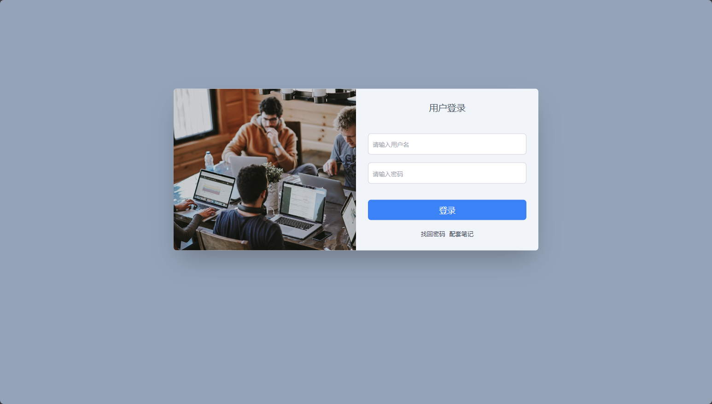
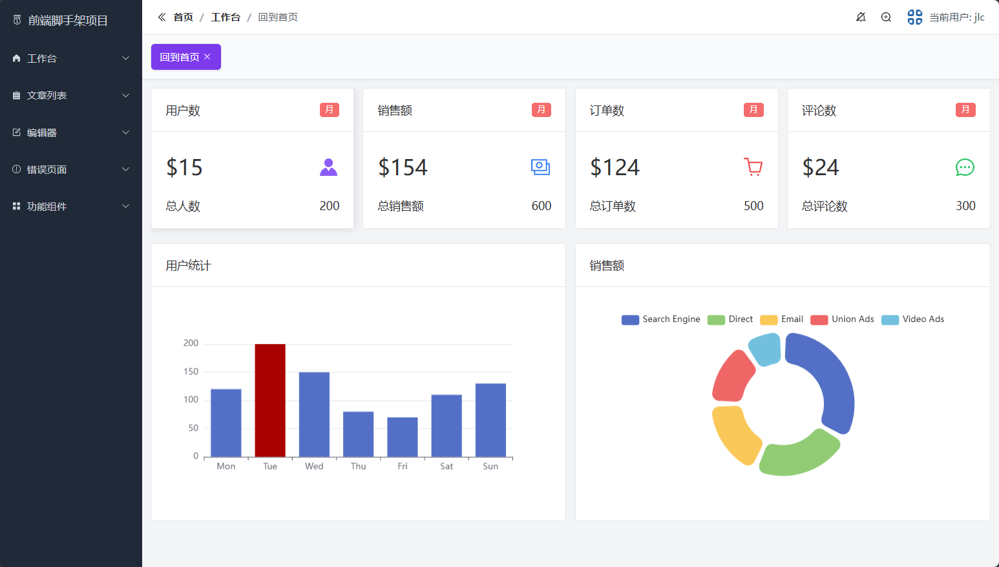
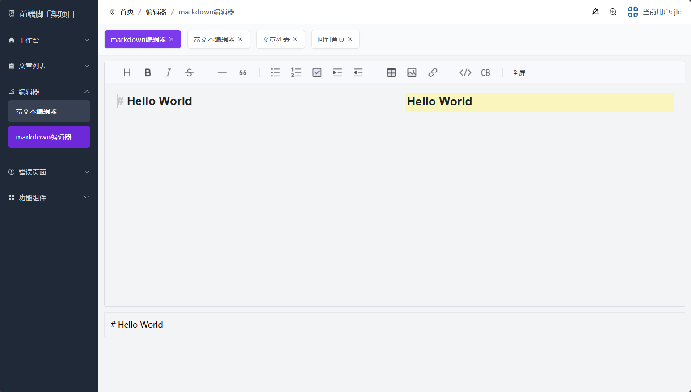

# README

前端脚手架项目，基于`Vue3`进行开发，包含了前端项目后台管理的基础部分（如界面、路由和权限控制等等），后续开发，直接在脚手架的基础上进行开发即可，极大的提高了效率

该前端脚手架的开发涉及到以下的相关知识：`Vue`、`JavaScript`、`Typescirpt`、`ElementPlus`、`Pinia`、`TailwindCss`、`Mockjs`、`Axios`、`Vue-router`、`wangeditor`和`toastEditor`等

具体的页面呈现：界面做了移动端和电脑端的设计，支持多端展示

